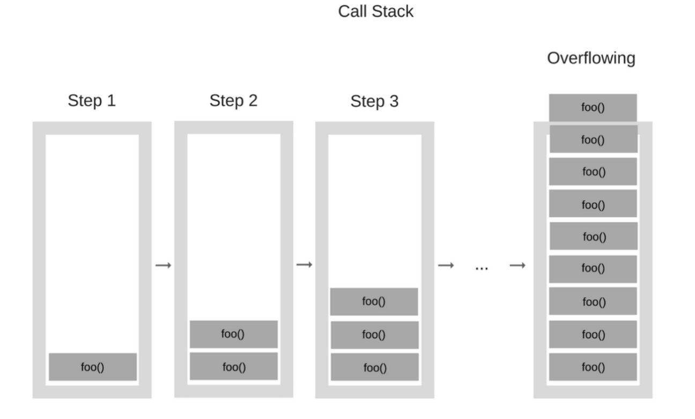

---

tags: 

edit: 2023-03-07

---

# Грокаем алгоритмы

## 1. Знакомство с алгоритмами

### Бинарный поиск

Бинарный поиск — алгоритм для поиска позиции заданного значения. На вход подается отсортированный массив значений (будь то строк, чисел) и значение, позицию которого необходимо найти. В результате работы возвращается искомый индекс или `null` (в случае, если элемента в массиве не оказалось).

#### Принцип работы

Принцип работы алгоритма следующий: сначала мы устанавливаем нижнюю и верхнюю границы `low`  и `high` соответственно, внутри которых будет выбираться индекс по середине. 

Изначально `low = 0` ,  `high = длина массива - 1` . 

Далее до тех пор, пока границы не сомкнуться в одной точке, сравниваем элемент на текущем индексе `mid = (high + low)/2` и искомый элемент:
1. Если  `mid`-элемент и искомый равный, возвращаем `mid`.
2. Если  `mid`-элемент больше искомого, обновляем `high = mid - 1`.
3. Иначе (`mid`-элемент меньше искомого) обновляем `low = mid + 1`.

При каждой итерации алгоритма исключается половина чисел, поэтому сложность — `O(logn)`

#### Код алгоритма

```typescript
function binarySearch(arr: number[], num: number){
	let low = 0;
	let high = arr.length - 1;
	
	while(low <= high){
		let mid = Math.floor((high+low)/2);
		if (num === arr[mid]){
			return mid;
		}
		if (arr[mid] > num){
			high = mid - 1;
		} else {
			low = mid + 1;
		}
	}
	return null;
}
```

#### Упражнения:

- Q: Имеется отсортированный список из 128 имён, и вы ищите в нем значение методом бинарного поиска. Какое максимальное кол-во проверок для этого может потребоваться? 
	- $$log_2128 = 7$$
- Q: Предположим, размер списка увеличился вдвое. Как изменится максимальное кол-во проверок?
	- +1 проверка

### «О-большое»

«О-большое» описывает то, насколько быстро работает алгоритм, с увеличением объема данных. Измеряется в количествах операций, а не секундах, потому что на разных устройствах скорость выполнения операций разнится. 

Причем «О-большое» определяется в «худшем случае». Скажем, есть линейный поиск. В лучшем случае «О-большое» — `O(1)`, потому что первый элемент массива совпадает с заданным. В худшем — `O(n)`. Точно определено, что медленнее `O(n)` алгоритм работать не будет.

### Типичные примеры «О-большого»

- $$O(logn)$$ — бинарный поиск
- $$O(n)$$ — линейный поиск
-  $$O(nlogn)$$ — быстрая сортировка 
- $$О(n^2)$$ — сортировка пузырьком
- $$O(n!)$$ — задача о коммивояжере

#### Упражнения

- Известна фамилия, нужно найти номер в телефонной книге.
	- Так как список фамилий отсортирован, то можно воспользоваться бинарным поиском. «О-большое» — $$O(logn)$$
- Известен номер, нужно найти фамилию в телефонной книге. (Подсказка: вам придется провести поиск по всей книге!)
	- Линейный поиск — $$O(n)$$
- Нужно прочитать номера всех людей в телефонной книге.
	- Линейный поиск — $$O(n)$$
- Нужно прочитать телефоны всех людей, фамилии которых начинаются с буквы «А».
	- $$O(\frac{n}{26}) = O(n)$$— потому что константы не учитываются. 


### Задача о коммивояжере

Есть несколько городов. Нужно составить маршрут с наименьшим суммарным расстоянием. 

**Решение**: перебрать все комбинации маршрутов и выбрать наименьший. 
Количество операций, необходимое для перебора, — `n!`

Для данной задачи эффективного быстрого алгоритма нет.


## 2. Сортировка выбором

#### Как работает память

Память компьютера устроена как большой шкаф с ящиками. В каждый ящик можно положить какое-то значение. Для хранения нескольких значений стоит использовать массивы или связанный список. 

Аналогия и иллюстрация в книге довольно удачные.


#### Массивы и связанные списки

Массивы — набор проиндексированных однотипных элементов. Мы знаем адрес каждого элемента. Если есть потребность обратиться к произвольному элементу, то лучше хранить набор данных в виде массива. Цена за доступ к элементу — `O(1)`. Однако если необходимо вставить элемент в массив, то уже время выполнения `O(n)`. Возможно, стоит подумать о списках. В связанных списках как раз ситуация противоположна. 

Связанные списки — структура данных, где каждый элемент имеет ссылку на следующий. Обратиться к произвольному элементу нельзя. Нужно начинать с первого элемента: у 1 элемента смотреть ссылку на 2 элемент, у 2 элемента ссылку на 3 элемент и так далее. Время — `O(n)`. Тем не менее вставка нового элемента в конец списка происходит за `O(1)`. Для вставки в середину или удаления элемента достаточно просто изменить указатель на предыдущий элемент. 

| | Массивы | Списки | 
| ------| ---------- | ---------|
| Чтение | $$O(1)$$ | $$O(n)$$|
| Вставка | $$O(n)$$| $$O(1)$$|
| Удаление| $$O(n)$$ |$$O(1)$$ |


#### Упражнения

- Допустим, вы строите приложение для управления финансами. Ежедневно вы записываете все свои траты. В конце месяца вы анализируете расходы и вычисляете, сколько денег было потрачено. При работе с данными выполняется множество операций вставки и относительно немного операций чтения. Какую структуру использовать — массив или список?
	- Список. Вставка выполняется за `O(1)`: к последнему элементу добавляем ссылку на новый. А операций чтения не так много, поэтому выбор в пользу списка.
- Допустим, вы пишете приложение для приема заказов от посетителей ресторана. Приложение должно хранить список заказов. Официанты добавляют заказы в список, а повара читают заказы из списка и выполняют их. Заказы образуют очередь: официанты добавляют заказы в конец очереди, а повар берет первый заказ из очереди и начинает готовить. Какую структуру данных вы бы использовали для реализации этой очереди — массив или связанный список? (Подсказка: связанные списки хорошо подходят для вставки/удаления, а массивы — для произвольного доступа к элементам. Что из этого понадобится в данном случае?)
	- Связанный список: добавление происходит в конец за `O(1)`, а заказы добавляются в конец очереди. Чтение происходит `O(1)`, потому что читается первый заказ в списке.
- Проведем мысленный эксперимент. Допустим, Facebook хранит список имен пользователей. Когда кто-то пытается зайти на сайт Facebook, система пытается найти имя пользователя. Если имя входит в список имен зарегистрированных пользователей, то вход разрешается. Пользователи приходят на Facebook достаточно часто, поэтому поиск по списку имен пользователей будет выполняться часто. Будем считать, что Facebook использует бинарный поиск для поиска в списке. Бинарному поиску необходим произвольный доступ — алгоритм должен мгновенно обратиться к среднему элементу текущей части списка. Зная это обстоятельство, как бы вы реализовали список пользователей — в виде массива или связанного списка?
	- Массив. Проивзольный доступ к элементу выполняется за `O(1)`, чего не скажешь о связанном списке.
- Пользователи также довольно часто создают новые учетные записи на Facebook. Предположим, вы решили использовать массив для хранения списка пользователей. Какими недостатками обладает массив для выполнения вставки? Допустим, вы используете бинарный поиск для нахождения учетных данных. Что произойдет при добавлении новых пользователей в массив?
	- Вставка в массив — медленная. Если массив фиксированной длины, то нужно создавать новый, копировать в него старые элементы и добавлять новый. Либо в случае динамического массива, если вставка происходит в начало массива, то позиции элементов справа нужно сдвинуть. В случае бинарного поиска после вставки элемента массив необходимо отсортировать, причем сортировка нужна при каждом добавлении нового элемента.
- В действительности Facebook не использует ни массив, ни связанный список для хранения информации о пользователях. Рассмотрим гибридную структуру данных: массив связанных списков. Имеется массив из 26 элементов. Каждый элемент содержит ссылку на связанный список. Например, первый элемент массива указывает на связанный список всех имен пользователей, начинающихся на букву «A». Второй элемент указывает на связанный список всех имен пользователей, начинающихся на букву «B», и т.д. Предположим, пользователь с именем «Adit B» регистрируется в Facebook и вы хотите добавить его в список. Вы обращаетесь к элементу 1 массива, находите связанный список элемента 1 и добавляете «Adit B» в конец списка. Теперь предположим, что зарегистрировать нужно пользователя «Zakhir H». Вы обращаетесь к элементу 26, который содержит связанный список всех имен, начинающихся с «Z», и проверяете, присутствует ли «Zakhir H» в этом списке. Теперь сравните эту гибридную структуру данных с массивами и связанными списками. Будет она быстрее или медленнее каждой исходной структуры при поиске и вставке? Приводить время выполнения «O-большое» не нужно, просто выберите одно из двух: быстрее или медленнее.
	- При поиске будет быстрее, чем связанный список, благодаря тому, что возможно обратиться за `O(1)` к нужной букве. В случае простого связанного списка обход приходилось бы начинать с самого начала. Однако поиск при массиве был бы быстрее. При вставке работает быстрее, чем массив; одинаково с односвязным списком.  

### Сортировка выбором 

В плане идеи того, как она работает, — довольно понятная. Однако затратная: время работы такой сортировки — $$O(n^2)$$
Идея: каждый раз, проходясь по массиву, ищем самый маленький по значению элемент. В результате нахождения элемента — закидываем его в новый массив, а в старом исключаем. И так проходимся до тех пор, пока массив не станет пустым. 

```
ЗДЕСЬ ДОЛЖНАЯ БЫТЬ РЕАЛИЗАЦИЯ НА JAVASCRIPT
```

## 3. Рекурсия

### Рекурсивная функция 

Рекурсивная функция — это функция, которая вызывает саму себя.
В книге приведена аналогия с коробками, демонстрирующая принцип работы рекурсии. 

Есть чемодан. В нём множество коробок. В каждой из этих коробок присутствуют ещё коробки. В одной коробок ключи. Нужно их найти. 

Можно решить задачу двумя подходами: 
1. Открываем чемодан. Закидываем коробки в общую кучу. Проходимся по коробкам. Если внутри коробки есть ещё коробки — закидываем в общую кучу. До тех пор, пока не посмотрим все коробки в куче, ищем ключи. 
2. Открываем чемодан. Открываем первую коробку. Если в ней коробка, то открываем коробку. Если во внутренней коробке ещё коробка, открываем коробку. И так далее. 

Первый подход подразумевает работу в цикле: к примеру, цикл `while (длина кучи != 0)`. 

Второй подход подразумевает как раз рекурсию:

```
искать_в_коробке (коробка){
	проходимся по элементам коробки:
		если это коробка:
			искать_в_коробке (текущий элемент коробки)
		иначе это ключи!
}

```


Обычно рекурсивная функция состоит из рекурсивного и базового случаев. Базовый случай гарантирует завершение рекурсивной функции. Рекурсивный случай обеспечивает саму рекурсию.

```js
function counter(count){
	console.log(count)
	count--;
	// Это базовый случай
	if (count === 0){ 
		return;
	}
	// Это рекурсивный случай
	else {
		counter(count);
	}
}
```

Если бы базовый случай отсутствовал, то функция выполнялась бы бесконечно долго.

```js
function counter(count){
	console.log(count)
	counter(--count);
}
```

Пара слов по поводу эффективности: чаще всего работа функции через цикл быстрее. И вот почему.

Введем такое понятие как «стек». Стек — это структура данных, идею которой можно сформулировать следующими словами: «первым пошёл — последним вышел». Если положить элемент на вершину стека, то первое, что читается из стека, как раз этот верхний элемент. 

Таким образом, стек поддерживает две операции: добавить на вершину стека (вставка, push) и извлечь из вершины стека (извлечение, pop).

В памяти компьютера есть свой стек вызовов. Каждый вызов функции со всеми своими локальными переменными помещается в стек вызовов. Когда функция заканчивает свое выполнение, она удаляется из вершины стека. Что же происходит со стеком вызовов в случае вызова рекурсивной функции? Посмотрим на примере функции `foo()`.

```js
function foo(){
	foo();
}

foo();
```



Как видно по рисунку, на первом шаге вызывается функция `foo` — соответственно, она помещается на вершину стека вызовов. Далее внутрии функции `foo`  вызывается функция `foo`, которая так же помещается на вершину стека. И так далее. В один момент случится переполнение в стеке и программа принудительно завершится. 

Собственно, в связи с тем, что стек вызовов может разрастаться, рекурсивная функция может быть не самым лучшем решением в той или иной задаче. 

Однако рекурсия может облегчить понимание кода программисту. Поэтому в зависимости от задачи стоит думать, что выбрать: легкость понимания благодаря рекурсии или эффективность работы благодаря циклу. 

